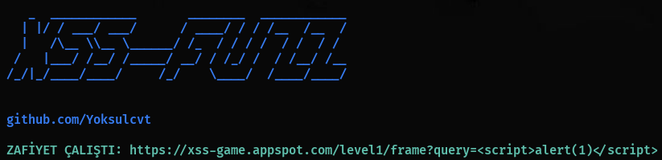

# XSS-FUZZ

URL parametrelerine payload göndererek yansıyan **(reflected) XSS** açıklarını tespit eden **basit** bir **araçtır**.

---

## ⚠️ NOT

Bu tool sadece **izin verilen yerlerde** kullanılmak için yazılmıştır.

- Bug bounty gibi programlarda **In-Scope** olan hedeflerde kullanılabilir.
- **Denial Of Service** gibi **Out-Of-Scope** yerlerde kullanmayınız.
- Tüm sorumluluk **KULLANICIYA** aittir.

---

## Kurulum

```bash
git clone https://github.com/Yoksulcvt/xss-fuzz.git
cd xss-fuzz
pip install -r requirements.txt
```

---

## Kullanım

### Temel kullanım

```bash
python3 xssfuzz.py -t "https://example.com/?search=XSS" -p payload.txt
```


> 💡 URL'deki **`XSS`** yazısı, payloadların enjekte edileceği noktadır.

---

## Parametreler

| Parametre | Açıklama |
|-----------|----------|
| `-t`, `--target` | Hedef URL |
| `-w`, `--payload-list` | Payload listesi dosyası |

---

## Ekran Görüntüsü



---

## Lisans

MIT